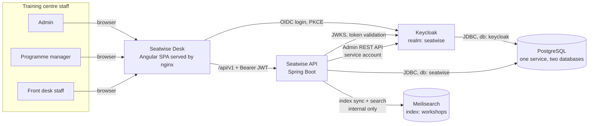
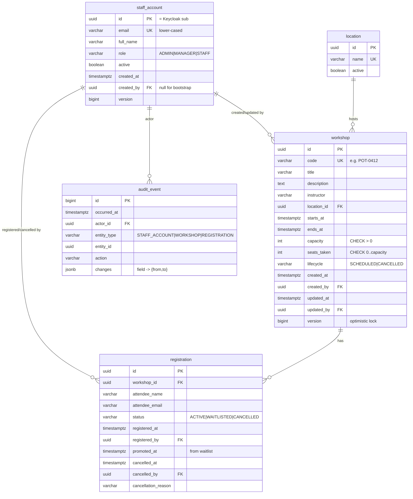
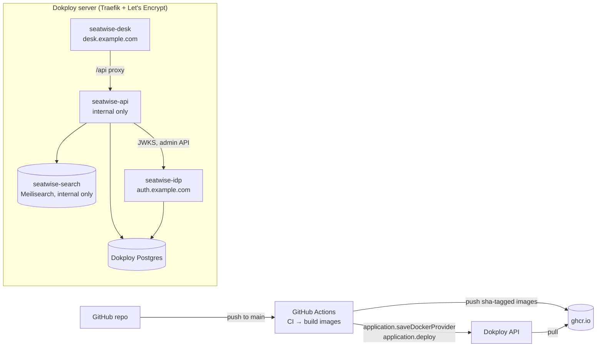

# Seatwise — Architecture

Workshop registration service for a community training centre (3 locations,
~15 staff). This document is the system map: what runs where, how the pieces
talk, and why. Requirements live in `docs/srs.md`; the build order lives in
`plans/implementation-plan.md`; delivery lives in `plans/cicd-dokploy.md`.

---

## 1. Goals that drive the design

In the order the brief ranks them:

1. **Access control enforced on the backend.** Every rule in the permission
   matrix is checked by the API, never only hidden in the UI.
2. **The capacity rule holds under concurrency.** A workshop can never hold
   more active registrations than its capacity, even when several front-desk
   staff hit "Register" for the last seat in the same instant.
3. **Registration history is never lost.** Cancellations free the seat but
   never delete the record. Who registered, who cancelled, and when, are
   always visible.
4. **A frontend that works end to end** for non-technical staff, with no
   training needed.
5. **Finding workshops fast:** by date range, status, location and "seats still
   available".
6. Bonus: an **audit trail** for workshop edits and account/role changes, and
   a **waitlist** that hands a freed seat to the next person in line.

---

## 2. Stack

| Layer | Choice | Version |
|---|---|---|
| Backend | Java + Spring Boot + Spring Modulith | Java 25, Boot 4.0.x, Modulith 2.0.x |
| Build | Gradle (wrapper) | 9.x |
| Database | PostgreSQL + Flyway | 17 |
| Identity | Keycloak (OIDC, Authorization Code + PKCE) | 26.x |
| Search | Meilisearch (workshop search index) + `meilisearch-java` client | v1.43.x |
| Frontend | Angular (standalone components, signals) + Tailwind CSS | 20.3.x, TS 5.9 |
| Frontend tooling | pnpm, Jest, Playwright | pnpm 9 |
| Runtime | Docker / Docker Compose locally, Dokploy in production | — |
| CI/CD | GitHub Actions → GHCR → Dokploy API | — |

**Why this stack:** it's the stack the team already runs in production, so the
time goes into the domain instead of the tooling. It also fits the problem:

- **PostgreSQL** gives us row-level locking, `CHECK` constraints and partial
  unique indexes. The capacity rule is enforced by the database itself, not
  just by application code.
- **Spring Modulith** keeps four small domains honest without turning them
  into microservices.
- **Meilisearch** gives front-desk staff instant, typo-tolerant search
  ("potery" still finds Pottery) with filters and facets. It's a *read
  index only*: PostgreSQL stays the source of truth, and bookings never
  consult it (section 7a).
- **Keycloak** gives us password storage, hashing, login screens,
  password-change-on-first-login and session handling for free. None of that
  should be hand-rolled in a 3-hour build.

---

## 3. System context



Attendees never touch the system. They are records typed in by staff, with no
accounts and no logins.

---

## 4. Containers

| Container | Image | Responsibility |
|---|---|---|
| `seatwise-desk` | `nginx:1.27-alpine` + built SPA | Serves the SPA. Reverse-proxies `/api/*` to the API, so the browser sees one origin and no CORS is needed. Writes `/config.json` from env vars at start, so one image runs in every environment. |
| `seatwise-api` | `eclipse-temurin:25-jre` + boot jar | REST API, business rules, Flyway migrations on start, first-Admin bootstrap. |
| `seatwise-idp` | `quay.io/keycloak/keycloak:26.x` + realm file | Authentication only: login, passwords, sessions, token issuing. |
| `seatwise-db` | `postgres:17-alpine` | One shared Postgres service with two databases: `seatwise` (app) and `keycloak` (IdP, own role). Same layout locally and on Dokploy. |
| `seatwise-search` | `getmeili/meilisearch:v1.43.0` | Workshop search index. Internal network only, reached only by the API, protected by a master key. All its data can be rebuilt from PostgreSQL at any time. |

### Authentication vs authorization: a deliberate split

- **Keycloak authenticates.** It proves *who* the user is (`sub` claim = the
  Keycloak user id).
- **The Seatwise database authorizes.** The user's role and active flag live
  in `staff_account`. On every request the API loads the row for `sub` and
  derives `ROLE_ADMIN | ROLE_MANAGER | ROLE_STAFF` from it.

Why not put roles in the JWT? Then a role change or deactivation would only
take effect when the token expires. With the role in our database the change
applies on the very next request, which is what an administrator expects when
they remove someone's access. It costs one primary-key lookup per request, and
with 15 users that's trivial. It also keeps the role model in one place that
the audit trail can see.

---

## 5. Backend: Spring Modulith modules

Base package `com.seatwise`. Each module is a direct sub-package with an
`@ApplicationModule` on its `package-info.java`. The module root holds only
the public API: interfaces, records and events. Everything else lives in
`<module>.internal`. `ModularityTests` runs `ApplicationModules.verify()` in
CI, so a boundary violation fails the build.

```mermaid
flowchart TB
    subgraph accounts["accounts"]
        SD[[StaffDirectory]]
    end
    subgraph workshops["workshops"]
        SI[[SeatInventory]]
        WC[[WorkshopCatalogue]]
    end
    subgraph registrations["registrations"]
        RS[RegistrationService]
    end
    subgraph audit["audit"]
        AL[AuditRecorder<br/>@EventListener]
    end
    subgraph search["search"]
        WS[WorkshopIndexer<br/>after-commit listener]
        WQ[WorkshopSearchController<br/>GET /workshops]
    end
    subgraph common["common (OPEN)"]
        SEC[security config, ProblemDetail errors,<br/>Clock, actor resolution]
    end

    registrations -->|claim/release seat| SI
    registrations -->|names for history| SD
    workshops -->|actor names| SD
    accounts -. events .-> AL
    workshops -. events .-> AL
    registrations -. events .-> AL
    workshops -. events .-> WS
    registrations -. events .-> WS
    search -->|fresh rows for re-index<br/>and result hydration| WC
```

| Module | Owns (tables) | Public API (module root) | Publishes |
|---|---|---|---|
| `accounts` | `staff_account` | `StaffDirectory` (look up active staff by id, `StaffSummary` record) | `StaffAccountCreated`, `StaffRoleChanged`, `StaffAccountDeactivated`, `StaffAccountReactivated`, `StaffPasswordReset` |
| `workshops` | `workshop`, `location` | `WorkshopCatalogue` (read views), `SeatInventory` (`tryClaimSeat`, `releaseSeat`, `requireBookable`) | `WorkshopScheduled`, `WorkshopUpdated`, `WorkshopCancelled` |
| `registrations` | `registration` | none (leaf module) | `AttendeeRegistered`, `AttendeeWaitlisted`, `RegistrationCancelled`, `WaitlistPromoted` |
| `audit` | `audit_event` | `AuditTrail` (query) | none |
| `search` | Meilisearch index `workshops` (no tables) | none (leaf module; owns the `GET /api/v1/workshops` list/search endpoint) | none |
| `common` | none | security, error model, `ActorProvider`, `Clock` bean | none |

**Inside a module:** `internal/` holds the `@RestController`, the
`@Service`, JPA entities, Spring Data repositories and request/response DTOs
(Java records with Bean Validation). Controllers stay thin and services own
transactions.

**Audit is synchronous on purpose.** `AuditRecorder` uses a plain
`@EventListener`, so it runs inside the publisher's transaction. If the
business change rolls back, the audit row rolls back with it, and an audit row
is never missing for a change that committed. Spring Modulith's asynchronous
`@ApplicationModuleListener` (with the event-publication registry) was
considered. It buys decoupling we don't need at this scale, at the cost of
eventual consistency in the very table that answers "who did this?".

---

## 6. Data model



### Database-level invariants (the safety net under the code)

| Invariant | Mechanism |
|---|---|
| Never more active registrations than seats | `workshop.seats_taken` maintained atomically (section 7) **plus** `ck_workshop_seats_within_capacity: CHECK (seats_taken BETWEEN 0 AND capacity)`. |
| Capacity can't be edited below seats already taken | The same `CHECK` makes the `UPDATE` fail. The API maps that to `409 CAPACITY_BELOW_TAKEN`. |
| One live booking per attendee per workshop | Partial unique index `uq_registration_live_attendee` on `(workshop_id, lower(attendee_email)) WHERE status IN ('ACTIVE','WAITLISTED')`. This also stops a double-click or a retried request from taking two seats. |
| Registrations are never deleted | `BEFORE DELETE` trigger on `registration` raises an exception. |
| Audit is append-only | `BEFORE UPDATE OR DELETE` trigger on `audit_event` raises an exception. |
| Cancel fields are consistent | `CHECK ((status = 'CANCELLED') = (cancelled_at IS NOT NULL))`. |
| A workshop ends after it starts | `CHECK (ends_at > starts_at)`. |

**Workshop status is partly derived.** Only the lifecycle (`SCHEDULED` /
`CANCELLED`) is stored. The status staff see is computed:

| Displayed status | Rule |
|---|---|
| `CANCELLED` | lifecycle = CANCELLED |
| `COMPLETED` | lifecycle = SCHEDULED and `ends_at < now` |
| `IN_PROGRESS` | lifecycle = SCHEDULED and `starts_at <= now < ends_at` |
| `FULL` | upcoming and `seats_taken = capacity` |
| `OPEN` | upcoming and `seats_taken < capacity` |

A stored "FULL" or "COMPLETED" flag would go stale the moment a seat frees up
or the clock passes. Deriving the status means it can never be wrong. The
`status` filter translates directly into SQL predicates on the same columns.

**Indexes:** `workshop(starts_at)`, `workshop(lifecycle, starts_at)`,
`registration(workshop_id, status)`, `audit_event(entity_type, entity_id,
occurred_at desc)`.

**Times** are stored as `timestamptz` (UTC). The centre's timezone is one
setting, `seatwise.centre-timezone`, used for "today / this week" filters and
for display.

---

## 7. The capacity rule under concurrency

### Register (the hot path)

All of this runs in one `@Transactional` method in
`registrations.internal.RegistrationService`:

```sql
-- 1. Claim a seat atomically. Only succeeds if one is left.
UPDATE workshop
   SET seats_taken = seats_taken + 1
 WHERE id = :workshopId
   AND lifecycle = 'SCHEDULED'
   AND starts_at > now()
   AND seats_taken < capacity;
-- rows affected = 1 → seat is ours, continue
-- rows affected = 0 → full (or not bookable): 409 WORKSHOP_FULL / WORKSHOP_NOT_OPEN,
--                     or WAITLISTED if the caller asked for the waitlist

-- 2. Insert the registration row (status ACTIVE).
--    A duplicate email hits the partial unique index → whole tx rolls back,
--    seat released automatically → 409 DUPLICATE_REGISTRATION
```

**Why this holds when ten people click at once:**

- The conditional `UPDATE` takes a row lock on that workshop. Concurrent
  registrations for the *same* workshop queue behind it.
- Under READ COMMITTED, each queued `UPDATE` re-checks its `WHERE` clause
  against the *committed* row once the lock is released. So the 21st request
  for a 20-seat workshop sees `seats_taken = 20` and affects zero rows.
- No "read, then check in Java, then write" window exists, which is exactly
  where the phone-and-spreadsheet process broke.
- Registrations for *different* workshops never contend with each other.
- Even if a future code path forgot this logic, the `CHECK` constraint makes
  an over-capacity commit impossible.

**JPA detail that matters:** `WorkshopEntity.seatsTaken` is mapped
`insertable = false, updatable = false`. A manager editing the title through
JPA can never write back a stale seat count. Only the two atomic statements
in `SeatInventory` touch that column.

**Alternatives considered:**

| Option | Verdict |
|---|---|
| `SELECT … FOR UPDATE` on the workshop, `COUNT(*)` active rows, then insert | Equally correct, but needs two round trips and a count on every booking. A fine fallback. |
| `SERIALIZABLE` isolation + retry | Correct, but pushes retry loops into the app for a problem one atomic statement solves. |
| JPA optimistic locking (`@Version`) on the workshop | Turns every simultaneous booking into a conflict and a retry, which is the opposite of what a busy Saturday needs. |
| DB trigger maintaining `seats_taken` | Strongest guarantee, but hides business logic in SQL. Rejected for readability. The `CHECK` already gives the hard backstop. |
| Application-level lock (`synchronized`, Redis lock) | Breaks as soon as there are two API instances. Rejected. |

**Proof:** an integration test against real PostgreSQL (Testcontainers) fires
50 parallel registrations at a 20-seat workshop through the service layer. It
asserts exactly 20 `ACTIVE` rows, 30 rejections, and `seats_taken = 20`. It
runs in CI on every push.

### Cancel

```sql
UPDATE registration
   SET status = 'CANCELLED', cancelled_at = now(), cancelled_by = :actor, cancellation_reason = :reason
 WHERE id = :id AND status IN ('ACTIVE', 'WAITLISTED');
-- 0 rows → 409 ALREADY_CANCELLED (a colleague got there first)
-- was ACTIVE → release the seat (seats_taken - 1), then try the waitlist
```

### Waitlist (bonus)

- When a workshop is full, staff can choose **"Add to waitlist"**. The row is
  stored as `WAITLISTED` and doesn't touch `seats_taken`. Queue order is
  `registered_at`.
- When an `ACTIVE` registration is cancelled, the same transaction picks the
  oldest `WAITLISTED` row for that workshop (`FOR UPDATE SKIP LOCKED`). It
  flips that row to `ACTIVE` with `promoted_at = now()`, so the seat passes
  straight to them and `seats_taken` never dips.
- The UI flags promoted attendees as **"Promoted from waitlist — call to
  confirm"**. Attendees have no accounts, so staff phone them, which matches
  how the centre already works. Declining is just a normal cancel, which
  cascades to the next person in line.

---

## 7a. Search with Meilisearch

**Role:** Meilisearch serves the workshop list and search screen ("which
workshops this week still have seats"). It is a **derived read index**.
PostgreSQL remains the source of truth, and nothing that changes data reads
from Meilisearch. The capacity rule (section 7) never consults it.

### Index `workshops`

One document per workshop:

```json
{
  "id": "6f1c…", "code": "POT-0412", "title": "Wheel-throwing for beginners",
  "instructor": "Amara Silva", "description": "…",
  "locationId": "…", "locationName": "Riverside",
  "startsAt": 1760169600, "endsAt": 1760176800,
  "lifecycle": "SCHEDULED", "capacity": 20, "seatsTaken": 17, "seatsLeft": 3
}
```

Times are stored as epoch seconds so they can be range-filtered.

| Setting | Value |
|---|---|
| `searchableAttributes` | `code`, `title`, `instructor`, `locationName`, `description` (in ranking order) |
| `filterableAttributes` | `startsAt`, `endsAt`, `lifecycle`, `locationId`, `seatsLeft` |
| `sortableAttributes` | `startsAt`, `title` |
| Typo tolerance | Default. Disabled on `code`, so `POT-0412` doesn't fuzzily match `POT-0421`. |
| `pagination.maxTotalHits` | 1000 |

### Query translation

`GET /api/v1/workshops?q=&from=&to=&status=&locationId=&hasSeats=` maps to
one Meilisearch search:

| API filter | Meilisearch filter |
|---|---|
| `from` / `to` (dates in the centre timezone) | `startsAt >= <from 00:00 local> AND startsAt < <to+1 00:00 local>` |
| `status=OPEN` | `lifecycle = SCHEDULED AND startsAt > <now> AND seatsLeft > 0` |
| `status=FULL` | `lifecycle = SCHEDULED AND startsAt > <now> AND seatsLeft = 0` |
| `status=IN_PROGRESS` | `lifecycle = SCHEDULED AND startsAt <= <now> AND endsAt > <now>` |
| `status=COMPLETED` | `lifecycle = SCHEDULED AND endsAt <= <now>` |
| `status=CANCELLED` | `lifecycle = CANCELLED` |
| several statuses | Each condition above, combined with `OR` |
| `hasSeats=true` | `seatsLeft > 0 AND lifecycle = SCHEDULED AND startsAt > <now>` |
| `locationId` | `locationId = <id>` |
| `q` | Meilisearch's full-text query |
| sort | `startsAt:asc` by default, unless `q` is present (then relevance first) |

Derived status needs no stored flag here either. Time-based conditions are
evaluated at query time against `now`.

### Keeping the index in sync

- **Incremental:** `search.internal.WorkshopIndexer` listens with
  `@TransactionalEventListener(phase = AFTER_COMMIT)` to `WorkshopScheduled`,
  `WorkshopUpdated`, `WorkshopCancelled`, `AttendeeRegistered`,
  `RegistrationCancelled` and `WaitlistPromoted`. It re-reads the workshop
  from `WorkshopCatalogue` (committed state, never the event payload) and
  upserts the document. It runs after commit, so a rolled-back booking never
  reaches the index.
- **Full rebuild:** `SearchIndexBootstrap` applies the index settings and
  re-indexes every workshop on application start, plus on a
  `@Scheduled` nightly reconcile. The data set is small (hundreds of
  workshops), so a full rebuild takes well under a second. This also heals
  any missed update.
- **Failure handling:** indexing failures are logged and retried by the next
  event or reconcile. They never fail the user's booking, which has already
  committed.

### Freshness and correctness

The index lags PostgreSQL by milliseconds after each commit, and by at most
one reconcile cycle if an update was lost. To keep the screen honest:

1. **Hydration:** after Meilisearch returns a page of ids (≤ 100), the API
   reloads `seatsTaken`, `capacity` and `lifecycle` for exactly those ids
   from PostgreSQL. The derived status and seat meter are always exact.
2. **The booking path ignores the index.** Even if a "has seats" result is a
   few milliseconds stale, registering still goes through the atomic
   PostgreSQL claim (section 7). The worst case is a polite "the last seat
   was just taken".

### Degraded mode

If Meilisearch is unreachable, `WorkshopSearch` falls back to an equivalent
PostgreSQL query (JPA Specification over the same filters, `ILIKE` for
`q`). The response carries `"searchMode": "fallback"`, and the UI shows a
subtle "Search is running in basic mode" note. Staff can always find
workshops, which matters more than typo tolerance. The Postgres
implementation also serves as the reference in tests: both
implementations must return the same ids for the same filters on the demo
data.

### Security

Meilisearch has no public domain or port in production. The API holds the
master key from the environment and, at bootstrap, derives a scoped API key
(`search` + `documents.*` + `settings.*` on index `workshops` only) for
runtime use. Authorization stays in the API: `GET /workshops` is
`CAN_VIEW_CATALOGUE` (Manager, Staff). Meilisearch is never called from the
browser.

---

## 8. Security model

### Permission matrix (enforced in the API)

| Capability | Endpoints | Admin | Manager | Staff |
|---|---|:-:|:-:|:-:|
| Manage staff accounts and roles | `/api/v1/staff-accounts/**` | ✅ | ❌ | ❌ |
| Add and edit workshops | `POST/PUT /api/v1/workshops`, `POST …/{id}/cancel` | ❌ | ✅ | ❌ |
| Register and cancel attendees | `POST …/workshops/{id}/registrations`, `POST /registrations/{id}/cancel` | ❌ | ✅ | ✅ |
| View workshops, registrations and history | `GET /api/v1/workshops/**`, `GET /api/v1/locations`, `GET …/registrations` | ❌ | ✅ | ✅ |
| Audit: account changes | `GET /api/v1/audit-events?entityType=STAFF_ACCOUNT` | ✅ | ❌ | ❌ |
| Audit: workshop and registration changes | `GET /api/v1/audit-events?entityType=WORKSHOP\|REGISTRATION` | ❌ | ✅ | ✅ |
| Own profile | `GET /api/v1/me` | ✅ | ✅ | ✅ |

The brief marks Admin as **not** viewing workshops. We follow it literally:
an Admin calling `GET /workshops` gets `403`. That's flagged as an assumption
in the SRS. If the centre wants Admins to see the catalogue, it's a one-line
change in the policy class plus its matrix test.

### Enforcement layers

1. **`SecurityFilterChain`**: stateless resource server. Rejects any
   unauthenticated `/api/**` request (`401`) and requires the JWT to come from
   the `seatwise` realm issuer with audience `seatwise-api`.
2. **`StaffAuthenticationConverter`** (in `accounts.internal`, so `common`
   never depends on a domain module): maps the JWT `sub` to the
   `staff_account` row. If the row is missing or inactive the request gets
   `403 ACCOUNT_INACTIVE`. Otherwise the converter grants exactly one
   authority, `ROLE_<role>`.
3. **Method security**: `@PreAuthorize` on every controller method, written
   against named constants in `common.security.Policies`
   (`CAN_MANAGE_STAFF`, `CAN_EDIT_WORKSHOPS`, `CAN_BOOK`, `CAN_VIEW_CATALOGUE`),
   so the matrix reads the same in code as in this table.
4. **The matrix test**: a parameterized `@WebMvcTest` iterates every
   endpoint × every role (plus anonymous). It asserts allowed means not-403
   and denied means 403/401. Adding an endpoint without a row in the test
   fails the build.

### Account lifecycle

- **First Admin:** there is no public signup. On startup
  `AdminBootstrapRunner` checks for an active ADMIN. If there is none, it
  creates one in Keycloak and in `staff_account` from
  `SEATWISE_BOOTSTRAP_ADMIN_EMAIL` / `…_PASSWORD`. It's idempotent: if the
  Keycloak user already exists it just links it. The password is marked
  temporary in production, so Keycloak forces a change at first login. In dev
  and demo it isn't temporary, so reviewers can log straight in.
- **Admin creates an account:** `POST /staff-accounts` →
  `KeycloakProvisioner` (Admin REST API, confidential client
  `seatwise-provisioner` with only `manage-users`/`view-users`) creates the
  user with a temporary password. The `staff_account` row is then inserted in
  the same request. If the DB insert fails, the Keycloak user is deleted as
  compensation.
- **Role change / deactivate / reactivate:** `PATCH /staff-accounts/{id}`.
  Deactivation also sets Keycloak `enabled=false`, so no new logins happen.
  The DB flag cuts off existing tokens immediately (see section 4).
- **Lock-out guards:** an Admin cannot change their own role or deactivate
  themselves, and the last active Admin can never be demoted or deactivated
  (`409 LAST_ADMIN`).
- **Accounts are never deleted.** History points at them.

### Other hardening

- Tokens: access token 5 min, refresh token 30 min idle. The SPA refreshes
  silently through keycloak-angular.
- Realm: `registrationAllowed = false`, brute-force detection on, a password
  policy (length ≥ 10).
- Request size limits, Bean Validation on every DTO, and output is JSON only.
  Angular escapes by default, so no HTML is ever accepted from users.
- Secrets come only from env vars (Dokploy env or a local `.env`). Nothing
  secret is baked into images.

---

## 9. API design

REST + JSON under `/api/v1`. The OpenAPI document is served by springdoc at
`/api/v1/openapi.json` (Swagger UI in the dev profile only).

| Method | Path | Purpose |
|---|---|---|
| GET | `/me` | Current staff member: id, name, email, role |
| GET | `/staff-accounts` | List accounts (filter by role, active) |
| POST | `/staff-accounts` | Create account (email, fullName, role, temporaryPassword) |
| GET | `/staff-accounts/{id}` | Account detail |
| PATCH | `/staff-accounts/{id}` | Change fullName / role / active (with `version`) |
| POST | `/staff-accounts/{id}/password-reset` | Set a new temporary password |
| GET | `/locations` | The three centre locations |
| GET | `/workshops` | Search via Meilisearch (section 7a): `from`, `to`, `status` (multi), `locationId`, `hasSeats`, `q` (typo-tolerant over code/title/instructor/location/description), `page`, `size`, `sort`. Response adds `searchMode: "index" \| "fallback"` |
| GET | `/workshops/{id}` | Detail incl. `capacity`, `seatsTaken`, `seatsLeft`, `waitlistCount`, derived `status`, `version` |
| POST | `/workshops` | Schedule a workshop |
| PUT | `/workshops/{id}` | Edit (body carries `version`; stale → `409 STALE_VERSION`) |
| POST | `/workshops/{id}/cancel` | Cancel a workshop (no new bookings; existing rows kept) |
| GET | `/workshops/{id}/registrations` | Full history incl. cancelled and waitlisted, with who/when |
| POST | `/workshops/{id}/registrations` | Register `{attendeeName, attendeeEmail, joinWaitlistIfFull}` → `201` with `status` ACTIVE or WAITLISTED |
| POST | `/registrations/{id}/cancel` | Cancel `{reason?}` → returns the cancelled row plus any promoted row |
| GET | `/audit-events` | `entityType`, `entityId`, `from`, `to`, paging (role-filtered, see section 8) |

**Conventions**

- Commands that are state transitions are explicit sub-resources (`/cancel`)
  rather than a `PATCH status`. They read clearly, authorize separately, and
  can't be confused with an edit.
- Paging: `page` / `size` (max 100), response
  `{ items, page, size, totalItems }`.
- **Errors** are RFC 9457 `application/problem+json`, with a stable machine
  `code` and a human `detail` the UI can show as-is:

| HTTP | `code` | When |
|---|---|---|
| 400 | `VALIDATION_FAILED` | Bean Validation; `errors[]` lists the fields |
| 401 | `UNAUTHENTICATED` | No/invalid token |
| 403 | `FORBIDDEN` / `ACCOUNT_INACTIVE` | Role not allowed / account deactivated |
| 404 | `NOT_FOUND` | Unknown id |
| 409 | `WORKSHOP_FULL` | No seat left and waitlist not requested |
| 409 | `WORKSHOP_NOT_OPEN` | Cancelled, started or finished |
| 409 | `DUPLICATE_REGISTRATION` | Same email already active or waitlisted for this workshop |
| 409 | `ALREADY_CANCELLED` | Someone else cancelled it first |
| 409 | `CAPACITY_BELOW_TAKEN` | Capacity edit lower than seats already taken |
| 409 | `STALE_VERSION` | Someone else edited the record since you loaded it |
| 409 | `EMAIL_IN_USE` / `LAST_ADMIN` / `SELF_MODIFICATION` | Account rules |
| 503 | `IDENTITY_UNAVAILABLE` | Keycloak admin API unreachable during account changes |

---

## 10. Frontend: Seatwise Desk

A single Angular 20 app at `frontend/` (project name `seatwise-desk`). It uses
standalone components, signals for state, reactive forms, Tailwind for
styling, and `HttpClient` services per feature (no generated client).

```
frontend/src/app/
├── core/
│   ├── auth/          keycloak-angular setup, SessionStore (signal of /me), roleGuard, landing redirect
│   ├── config/        runtime config loader (/config.json → issuer, clientId, apiBase)
│   ├── http/          bearer interceptor, problem-details interceptor → toast / inline errors
│   └── layout/        app shell, role-aware nav, toasts
├── features/
│   ├── workshops/     list + filters, detail, create/edit form (Manager)
│   ├── registrations/ register panel, cancel dialog, history table, waitlist badge
│   ├── staff-accounts/  list, create, edit role / deactivate, reset password (Admin)
│   └── activity/      audit timeline (reused on workshop detail and account detail)
└── shared/ui/         badge, seat meter, confirm dialog, empty state, date-range presets, data table
```

**Visual language: warm and minimal**

The UI uses a calm, warm, editorial look, so a busy front desk feels in
control rather than rushed. It's an original theme with no third-party
logos or brand assets. It's defined once as design tokens (CSS custom
properties feeding the Tailwind theme in `tailwind.config.js`):

| Token | Light | Dark | Use |
|---|---|---|---|
| `--canvas` | `#FAF9F5` (warm cream) | `#262624` | Page background |
| `--surface` | `#FFFFFF` | `#30302E` | Cards, tables, dialogs |
| `--surface-muted` | `#F0EEE6` | `#3A3936` | Table header, filter bar, hover |
| `--ink` | `#1F1E1D` | `#F5F4EF` | Primary text |
| `--ink-muted` | `#6B6963` | `#B7B5AC` | Secondary text, captions |
| `--line` | `#E5E2D9` | `#45443F` | Borders, dividers |
| `--accent` | `#C96442` (terracotta) | `#D97757` | Primary buttons, links, focus ring, seat meter fill |
| `--accent-soft` | `#F5E6DD` | `#4A3329` | Selected chips, active nav |
| `--ok` | `#4F7A5A` (sage) | `#7FAE89` | OPEN badge |
| `--warn` | `#B7791F` (ochre) | `#D9A548` | "1–3 seats left" |
| `--full` | `#A4442E` | `#E08A70` | FULL badge |
| `--quiet` | `#8A877E` | `#9C998F` | CANCELLED / COMPLETED badge |

- **Type:** headings in a serif (`Source Serif 4`, 600). UI and body text
  in a humanist sans (`Inter`, 400/500). Numbers in tables use
  `font-variant-numeric: tabular-nums`. Base size 15 px with roomy line
  height.
- **Shape and depth:** 10 px radius on cards and inputs, 8 px on buttons and
  chips. Hairline borders (`--line`) instead of heavy shadows, with a single
  soft shadow for dialogs only.
- **Space:** generous whitespace, content max-width 1200 px, 8-pt spacing
  scale. One primary (terracotta) action per view. Everything else is a
  quiet secondary or ghost button.
- **Motion:** 150 ms ease-out for hover and dialog fade. It respects
  `prefers-reduced-motion`.
- **Theme:** follows `prefers-color-scheme`, with a manual light/dark
  toggle in the top bar (remembered per browser).
- **Contrast:** every token pair used for text meets WCAG AA (≥ 4.5:1).
  Colour is never the only status signal, because badges always carry text.

**Screens by role**

| Role | Lands on | Sees |
|---|---|---|
| Admin | Staff accounts | Staff accounts, account activity |
| Manager | Workshops → "This week · has seats" | Workshops (+ create/edit/cancel), registrations, activity |
| Staff | Workshops → "This week · has seats" | Workshops, registrations (register/cancel), activity |

**UX decisions for a non-technical team**

- The workshop list opens pre-filtered to the client's own words: *"this week,
  still has seats"*. Presets: Today · This week · Next 7 days · Custom.
- Each row shows a seat meter, "3 of 20 left", plus a coloured status badge.
- Registering is a two-field form (name, email) on the workshop page. No
  modal juggling.
- Conflicts are explained in plain language and offer the next step. For
  example, on `WORKSHOP_FULL`: *"The last seat was just taken by a colleague.
  Add Priya to the waitlist instead?"* After that the seat count refreshes
  automatically.
- The workshop detail page re-fetches seat counts every 15 s while it's open,
  so Saturday-morning staff see seats disappear in near real time. Polling is
  enough here (SSE/WebSocket is listed as future work).
- Destructive actions (cancel a registration, cancel a workshop, deactivate an
  account) always confirm and accept an optional reason.
- Buttons the user's role can't use are hidden. That's for clarity only,
  because the API refuses them regardless.
- Accessibility: labelled inputs, visible focus, keyboard-operable dialogs,
  colour never the only signal.

---

## 11. Deployment topology

### Local (Docker Compose)

| Service | Container | Host port | Notes |
|---|---|---|---|
| `db` | `seatwise-db` | 5442 | `infra/postgres/init/` creates `seatwise` + `keycloak` DBs |
| `idp` | `seatwise-idp` | 8281 | `start-dev --import-realm`, realm file `infra/keycloak/seatwise-realm.json` |
| `search` | `seatwise-search` | 7710 | Meilisearch, `MEILI_ENV=development`, volume `search-data` |
| `api` | `seatwise-api` | 8280 | profiles `dev,demo` (seeds sample workshops + demo Manager/Staff) |
| `desk` | `seatwise-desk` | 4280 | nginx, proxies `/api` → `api:8080` |

The ports are chosen to avoid clashing with other local stacks (5432, 4200,
8080). For fast inner-loop work, run `db` + `idp` in Compose, the API with
`./backend/gradlew -p backend bootRun`, and the SPA with `pnpm -C frontend
start` on port 4210 (dev-server proxy to 8280).

### Production (Dokploy)



- Only `desk` and `idp` have public domains. The API is reached through the
  desk's `/api` proxy on Dokploy's internal network.
- The API validates `iss` against the public Keycloak URL but fetches JWKS and
  calls the admin API over the internal network
  (`spring.security.oauth2.resourceserver.jwt.jwk-set-uri` overridden).
- Health: `/actuator/health` (liveness/readiness) is used by Dokploy health
  checks. `/actuator/info` exposes the git SHA, so the pipeline can prove
  which build is running.

Full pipeline: `plans/cicd-dokploy.md`.

---

## 12. Testing strategy

| Level | Tooling | What it proves |
|---|---|---|
| Module structure | `ApplicationModules.verify()` | No module reaches into another's `internal` |
| Authorization matrix | `@WebMvcTest` + `spring-security-test` `jwt()` | Every endpoint × role → allowed / 403 / 401 |
| Domain services | JUnit 5 + Testcontainers PostgreSQL | Register / cancel / waitlist promotion, duplicate email, capacity edit rules |
| **Concurrency** | Testcontainers + `ExecutorService` + `CountDownLatch` | 50 parallel bookings, 20 seats → exactly 20 succeed; `seats_taken` equals the active count |
| Search | Testcontainers PostgreSQL + Meilisearch (`GenericContainer`) | Every filter, typo tolerance, timezone week boundary. The index reflects a booking/cancel after commit. A rolled-back booking never reaches the index. Index and fallback return the same ids. Hydration overrides stale seat counts. |
| Frontend units | Jest + jest-preset-angular | Guards, interceptors, SessionStore, filter→query mapping |
| End to end | Playwright against the Compose stack | Log in as each demo role; book the last seat; see the full-workshop message; cancel; see the seat freed |

---

## 13. Repository layout

```
seatwise/
├── backend/                 Spring Boot app (Gradle wrapper, Dockerfile)
│   └── src/main/java/com/seatwise/{accounts,workshops,registrations,audit,search,common}/
│   └── src/main/resources/db/migration/   V1__… Flyway
│   └── src/main/resources/db/demo/        R__demo_workshops.sql (demo profile only)
├── frontend/                Angular app seatwise-desk (pnpm, Dockerfile, nginx/desk.conf.template)
├── infra/
│   ├── keycloak/            seatwise-realm.json + production Dockerfile
│   └── postgres/init/01-databases.sh
├── docs/                    architecture.md, srs.md, design-notes.md (the one-pager)
├── plans/                   implementation-plan.md, cicd-dokploy.md
├── .github/workflows/       ci.yml, deliver.yml
├── compose.yaml
├── .env.example
└── README.md                setup in under 5 minutes, demo logins
```

---

## 14. Key decisions and trade-offs (summary)

| Decision | Trade-off accepted |
|---|---|
| Atomic conditional `UPDATE` + `CHECK` for capacity | Small denormalized counter (`seats_taken`). Kept honest by the `CHECK`, by being the only write path, and by the concurrency test. |
| Roles in the app DB, Keycloak for authentication only | One indexed lookup per request. Keycloak's own role UI isn't used. |
| Keycloak instead of hand-rolled auth | One more container to run, and a heavier local setup than a JWT-only API. In return there's no password handling in our code. |
| Spring Modulith monolith, not services | One deployable, and modules can't scale separately. That's right for 15 users. |
| Synchronous audit in the same transaction | Audit write latency is on the request path (negligible). |
| Derived workshop status | Status filter is a computed predicate instead of a column equality, evaluated at query time in Meilisearch and in the Postgres fallback alike. |
| Meilisearch as a derived read index | One more container, and an index that lags by milliseconds. Mitigated by after-commit sync, startup and nightly rebuilds, hydrating seat counts from PostgreSQL, and a Postgres fallback. Bookings never depend on it. |
| Warm, minimal token-based theme | A small custom token set instead of a component library's look. Every screen inherits it, and dark mode is a token swap. |
| Waitlist auto-promotes and staff phone the attendee | No self-service "accept the offer" flow. Fine because attendees have no accounts. |
| Polling for seat counts | Up to 15 s staleness on screen. The API is always authoritative, so a stale screen can't overbook. |
| Admin can't view workshops (literal reading of the brief) | An Admin who wants to help at the front desk needs a Staff account too. |
