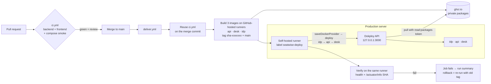

# Seatwise — CI/CD Plan (GitHub Actions → GHCR → Dokploy)

How code gets from a pull request to the live server. GitHub-hosted runners
build and test everything, then push immutable images to the GitHub Container
Registry. A **self-hosted runner on the Dokploy server** runs only the final
deploy and verify jobs: it tells Dokploy which tag to run over the server's
loopback interface, so the Dokploy API never has to be reachable from the
internet. Dokploy only pulls and runs images. **Dokploy never builds from
source.** What CI tested is exactly what runs.

**Context that shapes this plan**

- The GitHub repository is **private**, so its GHCR packages are private too
  and Dokploy needs a registry credential (§5.2).
- Dokploy runs as a Docker Swarm service on the production server, published
  on host port 3000 (checked 2026-10-09, §4a). Its UI is served over HTTPS at
  `https://dok.dev.waahanasale.lk` through Traefik, and port 3000 is closed in
  the cloud firewall. The deploy runner calls the API on
  `http://127.0.0.1:3000`, so the API never has to be reachable from outside.
- The server is **`aarch64`** (ARM), so images are built for `linux/arm64`
  (§4b).
- Public domains: desk `https://desk.waahanasale.lk`, identity provider
  `https://auth.waahanasale.lk`.
- Builds stay off the production box. It is small and serves live traffic,
  so only the two lightweight `curl` jobs run there.

---

## 1. Flow



The runner only makes **outbound** HTTPS connections to GitHub (it long-polls
for jobs), so no inbound port is opened for CI.

**Branching:** trunk-based. `main` is always deployable and protected. Work
happens on short-lived `feat/*` and `fix/*` branches merged by PR. There is
no `develop` and no staging environment. A single production environment is
proportionate for a 15-user internal tool, and the PR checks carry the
quality gate.

---

## 2. Repository settings (one-time)

| Setting | Value |
|---|---|
| Branch protection on `main` | Require PR; require status checks `ci / backend`, `ci / frontend`, `ci / compose-smoke`; require branch up to date; no force-push; no deletion |
| Visibility | **Private** |
| Actions → Workflow permissions | Read-only by default; jobs request `packages: write` explicitly |
| Actions → Fork pull request workflows | Off (no workflows from forks of the private repo) |
| Actions → Runners | One repository-level self-hosted runner with the extra label `seatwise-deploy` (§4a) |
| Environment `production` | Deployment branches: `main` only. Optional: a required reviewer for a manual gate |
| Environment secrets (`production`) | `DOKPLOY_API_KEY` (Dokploy → Settings → Profile → API/CLI → generate) |
| Environment variables (`production`) | See the table below |
| Repository variables (image build) | `IMAGE_PLATFORM` = `linux/arm64`, `IMAGE_RUNNER` = `ubuntu-24.04-arm` (the server is `aarch64`, §4b) |
| Dependabot | `github-actions`, `gradle` (`/backend`), `npm` (`/frontend`), weekly |

**`production` environment variables**

| Variable | Value |
|---|---|
| `DOKPLOY_URL` | `http://127.0.0.1:3000`, the Dokploy API as the deploy runner sees it on the server's loopback (§4a). Not the public panel domain. |
| `DOKPLOY_APP_ID_IDP` | Id of the `seatwise-idp` application, from its Dokploy URL (§5.1) |
| `DOKPLOY_APP_ID_API` | Id of `seatwise-api` |
| `DOKPLOY_APP_ID_DESK` | Id of `seatwise-desk` |
| `PUBLIC_DESK_URL` | `https://desk.waahanasale.lk` |
| `PUBLIC_IDP_URL` | `https://auth.waahanasale.lk` |

Application secrets (DB passwords, Keycloak admin, provisioner secret,
bootstrap admin) are **not** stored in GitHub. They live only in Dokploy's
per-application environment. GitHub only holds the credential needed to tell
Dokploy to deploy.

---

## 3. `ci.yml`: the quality gate

Triggers: `pull_request` (any branch → `main`), `push` to `main`, and
`workflow_call` (so `deliver.yml` can reuse it).

```yaml
name: ci
on:
  pull_request:
  push:
    branches: [main]
  workflow_call:

concurrency:
  group: ci-${{ github.ref }}
  cancel-in-progress: ${{ github.event_name == 'pull_request' }}

permissions:
  contents: read

jobs:
  backend:
    runs-on: ubuntu-24.04
    steps:
      - uses: actions/checkout@v4
      - uses: actions/setup-java@v4
        with: { distribution: temurin, java-version: '25' }
      - uses: gradle/actions/setup-gradle@v4
      # build = compile + ModularityTests + AccessMatrixTest + Testcontainers ITs
      # (CapacityConcurrencyIT included). Ubuntu runners ship Docker.
      - run: ./backend/gradlew -p backend build --no-daemon
      - if: always()
        uses: actions/upload-artifact@v4
        with:
          name: backend-test-reports
          path: backend/build/reports/tests/
      - uses: actions/upload-artifact@v4
        with:
          name: api-jar
          path: backend/build/libs/*.jar
          retention-days: 3

  frontend:
    runs-on: ubuntu-24.04
    steps:
      - uses: actions/checkout@v4
      - uses: pnpm/action-setup@v4
      - uses: actions/setup-node@v4
        with: { node-version: '22', cache: pnpm, cache-dependency-path: frontend/pnpm-lock.yaml }
      - run: pnpm -C frontend install --frozen-lockfile
      - run: pnpm -C frontend lint
      - run: pnpm -C frontend test --ci
      - run: pnpm -C frontend build
      - uses: actions/upload-artifact@v4
        with:
          name: desk-dist
          path: frontend/dist/
          retention-days: 3

  compose-smoke:
    needs: [backend, frontend]
    runs-on: ubuntu-24.04
    steps:
      - uses: actions/checkout@v4
      - run: cp .env.example .env
      - run: docker compose up -d --build --wait --wait-timeout 240
      - uses: pnpm/action-setup@v4
      - uses: actions/setup-node@v4
        with: { node-version: '22', cache: pnpm, cache-dependency-path: frontend/pnpm-lock.yaml }
      - run: pnpm -C frontend install --frozen-lockfile
      - run: pnpm -C frontend exec playwright install --with-deps chromium
      - run: pnpm -C frontend e2e
        env: { E2E_BASE_URL: 'http://localhost:4280' }
      - if: failure()
        run: docker compose logs --no-color > compose-logs.txt
      - if: failure()
        uses: actions/upload-artifact@v4
        with: { name: compose-logs, path: compose-logs.txt }
```

Notes:

- `compose-smoke` proves that the four containers start together with the
  same `compose.yaml` reviewers will use, and that login plus booking work in
  a real browser. If it gets slow, run it only on PRs into `main` (it already
  is).
- `cancel-in-progress` applies only to PRs. A push to `main` runs to
  completion.
- Pin action versions by tag now. Move to commit SHAs with Dependabot later
  (logged in `BACKLOG.md`).

---

## 4. `deliver.yml`: build, push, deploy, verify

Triggers: `push` to `main`, plus `workflow_dispatch` with an optional
`image_tag` input (for rollback or redeploy).

```yaml
name: deliver
on:
  push:
    branches: [main]
  workflow_dispatch:
    inputs:
      image_tag:
        description: 'Existing tag to (re)deploy, e.g. sha-1a2b3c4. Empty = build this commit.'
        required: false

concurrency:
  group: deliver-production
  cancel-in-progress: false        # never stop a release halfway

permissions:
  contents: read

env:
  REGISTRY: ghcr.io

jobs:
  gate:
    if: ${{ inputs.image_tag == '' }}
    uses: ./.github/workflows/ci.yml

  images:
    needs: gate
    if: ${{ inputs.image_tag == '' }}
    # GitHub-hosted, never the production box. Native arm64 or amd64 per §4b.
    runs-on: ${{ vars.IMAGE_RUNNER || 'ubuntu-24.04' }}
    permissions: { contents: read, packages: write }
    strategy:
      matrix:
        include:
          - { name: api,  context: backend,        file: backend/Dockerfile }
          - { name: desk, context: frontend,       file: frontend/Dockerfile }
          - { name: idp,  context: infra/keycloak, file: infra/keycloak/Dockerfile }
    steps:
      - uses: actions/checkout@v4
      # GHCR image names must be lower-case; the owner name may not be.
      - run: echo "IMAGE_PREFIX=ghcr.io/${GITHUB_REPOSITORY_OWNER,,}/seatwise" >> "$GITHUB_ENV"
      - uses: docker/setup-buildx-action@v3
      - uses: docker/login-action@v3
        with: { registry: ghcr.io, username: '${{ github.actor }}', password: '${{ secrets.GITHUB_TOKEN }}' }
      - id: meta
        uses: docker/metadata-action@v5
        with:
          images: ${{ env.IMAGE_PREFIX }}-${{ matrix.name }}
          tags: |
            type=sha,prefix=sha-,format=short
            type=raw,value=main
          labels: org.opencontainers.image.revision=${{ github.sha }}
      - uses: docker/build-push-action@v6
        with:
          context: ${{ matrix.context }}
          file: ${{ matrix.file }}
          push: true
          platforms: ${{ vars.IMAGE_PLATFORM || 'linux/amd64' }}   # must match the server (§4b)
          build-args: GIT_SHA=${{ github.sha }}
          tags: ${{ steps.meta.outputs.tags }}
          labels: ${{ steps.meta.outputs.labels }}
          cache-from: type=gha,scope=${{ matrix.name }}
          cache-to: type=gha,mode=max,scope=${{ matrix.name }}

  deploy:
    needs: images
    if: ${{ always() && (needs.images.result == 'success' || inputs.image_tag != '') }}
    # The self-hosted runner on the Dokploy server (§4a). No checkout: nothing
    # from the repository is executed on the production box, only this script.
    runs-on: [self-hosted, linux, seatwise-deploy]
    timeout-minutes: 15
    environment:
      name: production
      url: ${{ vars.PUBLIC_DESK_URL }}
    steps:
      - name: Resolve image prefix and tag
        id: tag
        run: |
          echo "IMAGE_PREFIX=ghcr.io/${GITHUB_REPOSITORY_OWNER,,}/seatwise" >> "$GITHUB_ENV"
          if [ -n "${{ inputs.image_tag }}" ]; then echo "tag=${{ inputs.image_tag }}" >> "$GITHUB_OUTPUT"
          else echo "tag=sha-${GITHUB_SHA::7}" >> "$GITHUB_OUTPUT"; fi
      - name: Check the Dokploy API answers and the key works
        env:
          DOKPLOY_URL: ${{ vars.DOKPLOY_URL }}
          DOKPLOY_API_KEY: ${{ secrets.DOKPLOY_API_KEY }}
        run: |
          # An authenticated read that only Dokploy answers with a JSON array.
          # A bare "does the port answer" check would pass against any app on
          # that port and then send the deploy calls to the wrong place.
          body=$(mktemp)
          code=$(curl -sS -o "$body" -w '%{http_code}' --max-time 10 \
            -H "x-api-key: $DOKPLOY_API_KEY" "$DOKPLOY_URL/api/project.all") || code=000
          if [ "$code" != 200 ] || ! jq -e 'type == "array"' "$body" > /dev/null; then
            echo "No Dokploy API at $DOKPLOY_URL (HTTP $code): wrong port or app, Dokploy down, or a bad API key."
            exit 1
          fi
      - name: Deploy idp → api → desk
        env:
          DOKPLOY_URL: ${{ vars.DOKPLOY_URL }}
          DOKPLOY_API_KEY: ${{ secrets.DOKPLOY_API_KEY }}
          TAG: ${{ steps.tag.outputs.tag }}
        run: |
          set -euo pipefail
          deploy() {  # $1 = app id, $2 = image
            # Point the app at the exact immutable tag. Credentials are null:
            # Dokploy pulls with the registry login saved once on the server (§5.2).
            curl -fsS -X POST "$DOKPLOY_URL/api/application.saveDockerProvider" \
              -H "x-api-key: $DOKPLOY_API_KEY" -H 'Content-Type: application/json' \
              -d "{\"applicationId\":\"$1\",\"dockerImage\":\"$2\",\"username\":null,\"password\":null,\"registryUrl\":null}"
            curl -fsS -X POST "$DOKPLOY_URL/api/application.deploy" \
              -H "x-api-key: $DOKPLOY_API_KEY" -H 'Content-Type: application/json' \
              -d "{\"applicationId\":\"$1\"}"
          }
          deploy "${{ vars.DOKPLOY_APP_ID_IDP }}"  "$IMAGE_PREFIX-idp:$TAG"
          deploy "${{ vars.DOKPLOY_APP_ID_API }}"  "$IMAGE_PREFIX-api:$TAG"
          deploy "${{ vars.DOKPLOY_APP_ID_DESK }}" "$IMAGE_PREFIX-desk:$TAG"
          echo "Deployed $TAG" >> "$GITHUB_STEP_SUMMARY"

  verify:
    needs: deploy
    runs-on: [self-hosted, linux, seatwise-deploy]
    timeout-minutes: 10
    steps:
      - name: Wait for health and prove the running SHA
        env:
          DESK: ${{ vars.PUBLIC_DESK_URL }}
          IDP: ${{ vars.PUBLIC_IDP_URL }}
          EXPECTED: ${{ inputs.image_tag != '' && '' || github.sha }}
        run: |
          set -euo pipefail
          # Talk to the local Traefik with the real host names (correct SNI and
          # certificates) instead of hair-pinning out through the server's own
          # public IP, which cloud NAT often doesn't route back.
          DESK_HOST=${DESK#https://}; IDP_HOST=${IDP#https://}
          c() { curl -fsS --max-time 10 --resolve "$DESK_HOST:443:127.0.0.1" --resolve "$IDP_HOST:443:127.0.0.1" "$@"; }
          for i in $(seq 1 40); do
            if c "$DESK/api/actuator/health/readiness" | grep -q '"UP"'; then break; fi
            sleep 6
          done
          c "$DESK/api/actuator/health/readiness" | grep -q '"UP"'
          c "$DESK/" | grep -qi '<sw-root'
          c "$IDP/realms/seatwise/.well-known/openid-configuration" > /dev/null
          if [ -n "$EXPECTED" ]; then
            RUNNING=$(c "$DESK/api/actuator/info" | jq -r '."git-sha"')
            echo "running=$RUNNING expected=$EXPECTED"
            [ "$RUNNING" = "$EXPECTED" ]
          fi
```

Why each choice:

- **Reusing `ci.yml` as the gate** means the merge commit itself is tested
  before anything ships, not just the PR head.
- **Immutable `sha-` tags.** Dokploy is pointed at an exact tag, so a deploy
  is reproducible and rollback is a re-point. `main` is a convenience tag
  only, never deployed by name.
- **Deploy order idp → api → desk.** The API needs the realm to be up for
  JWKS and the provisioner. The desk is last so the UI never runs ahead of
  the API.
- **Verify by SHA, not by "deploy succeeded".** A successful
  `application.deploy` call only means Dokploy accepted the job. The verify
  job proves the new build is the one actually serving traffic.
- **`/actuator/*` through the desk proxy:** expose only `health` and `info`
  publicly. The desk nginx proxies `/api/actuator/(health|info)` and nothing
  else under actuator.
- **Only deploy and verify run on the server.** Building three images (Gradle,
  Angular, Keycloak) would compete with production for CPU and memory, so
  builds stay on GitHub-hosted runners. The two server jobs are a handful of
  `curl` calls.

---

## 4a. Self-hosted deploy runner (one-time, on the production server)

### Why

The repository is private, and the Dokploy API may not be reachable from the
internet (and shouldn't need to be). A runner on the same machine reaches
Dokploy at `http://127.0.0.1:3000`, and it only needs outbound HTTPS to
`github.com`. This is the same shape as a CI runner sharing the box with the
deployment platform, which is how automatic updates worked before.

### Install

On the server, as a sudo-capable user:

```bash
# 0. Facts this plan depends on (results for this server: see "Port discovery" below)
uname -m                                         # aarch64 → arm64 images (§4b); x86_64 → amd64
# Dokploy API answers on loopback with the API key: expect HTTP 200 and a JSON array
curl -sS -w '\nHTTP %{http_code}\n' -H "x-api-key: <DOKPLOY_API_KEY>" http://127.0.0.1:3000/api/project.all | tail -c 300
history -d $(history 1)                          # keep the key out of shell history

# 1. Dedicated, unprivileged user. Not in the docker group: it never needs Docker.
sudo useradd --create-home --shell /bin/bash gh-runner
sudo apt-get install -y curl jq                  # the only tools the jobs use

# 2. Download and register. GitHub → repo → Settings → Actions → Runners →
#    "New self-hosted runner" shows the exact version, checksum and a one-hour token.
sudo -iu gh-runner
mkdir actions-runner && cd actions-runner
curl -fsSLO https://github.com/actions/runner/releases/download/v<version>/actions-runner-linux-<arm64|x64>-<version>.tar.gz
echo "<sha256>  actions-runner-linux-<arm64|x64>-<version>.tar.gz" | sha256sum -c
tar xzf actions-runner-linux-*.tar.gz
./config.sh --url https://github.com/ayeshdev/seatwise --token <registration-token> \
  --name seatwise-prod --labels seatwise-deploy --work _work --unattended
exit

# 3. Run as a service that starts on boot
cd /home/gh-runner/actions-runner
sudo ./svc.sh install gh-runner
sudo ./svc.sh start
sudo ./svc.sh status
```

The runner shows as **Idle** under Settings → Actions → Runners with labels
`self-hosted`, `Linux`, `ARM64`/`X64` and `seatwise-deploy`.

### Port discovery (done 2026-10-09)

Other applications on this server also listen on port 3000 *inside their own
containers* (for example the existing `waahanasale.lk` app). That doesn't
occupy the host's port 3000; only a published port does. Which process owns
the host port was checked directly:

```bash
sudo ss -ltnp | grep -E ':3000\b'
#   LISTEN 0.0.0.0:3000  users:(("docker-proxy",...))     ← a published container port
sudo docker ps --format '{{.Names}}\t{{.Ports}}' | grep -i dokploy
#   dokploy.1.…      0.0.0.0:3000->3000/tcp               ← it is Dokploy's
#   dokploy-traefik  0.0.0.0:80->80/tcp, 0.0.0.0:443->443/tcp
sudo docker service inspect dokploy --format '{{json .Endpoint.Ports}}'
#   [{"Protocol":"tcp","TargetPort":3000,"PublishedPort":3000,"PublishMode":"host"}]
```

Result: host port 3000 is Dokploy, published in `host` mode, so
`DOKPLOY_URL=http://127.0.0.1:3000`. Closing port 3000 in the cloud firewall
(Hardening, below) doesn't affect this, because loopback traffic never passes
through the cloud firewall.

If a reinstall ever changes this:

- **Dokploy published on another host port N:** set `DOKPLOY_URL` to
  `http://127.0.0.1:N`.
- **Dokploy not published on the host at all:** use the panel domain
  (`https://dok.dev.waahanasale.lk`) and add
  `--resolve dok.dev.waahanasale.lk:443:127.0.0.1` to the deploy `curl` calls,
  the same approach as the verify job. That reaches the local Traefik with the
  right hostname and certificate instead of hair-pinning through the public IP.

Either way, the authenticated check in the deploy job (§4) fails loudly if
`DOKPLOY_URL` points at anything other than a working Dokploy API.

### Hardening

| Measure | Why |
|---|---|
| Repository-scoped runner, private repo, fork PR workflows off | Only collaborators' code can schedule jobs. Self-hosted runners are mainly dangerous on public repos. |
| Only `deliver.yml` uses the `seatwise-deploy` label; `ci.yml` and PR jobs never do | Untested branch code never runs on the production box |
| Deploy and verify jobs don't check out the repository | Nothing but the workflow's own inline script runs on the server |
| `production` environment limited to `main` | `DOKPLOY_API_KEY` is only released to jobs from `main` |
| Unprivileged `gh-runner` user, not in the `docker` group | A compromised job can call the Dokploy API but can't control Docker or read other containers' volumes |
| No inbound port for CI | The runner long-polls GitHub over outbound HTTPS |
| Block port 3000 from the internet in the **cloud firewall** (VCN security list / NSG): remove any ingress rule for 3000. Reach the Dokploy UI only through `https://dok.dev.waahanasale.lk`. | Dokploy publishes 3000 on `0.0.0.0`, which exposes its login and API over plain HTTP. **`ufw` can't close it:** Docker writes its own iptables rules for published ports, and they're evaluated before `ufw`'s, so `ufw deny 3000` looks applied and blocks nothing. Check from a machine outside the server: `curl -m 5 http://<server-ip>:3000` must time out, while `curl http://127.0.0.1:3000` on the server still answers. |
| The runner auto-updates; check `svc.sh status` after OS upgrades | A stopped runner leaves deploys queued (§6) |

Accepted residual risk: anyone with write access to the private repository
could add a workflow on another branch that targets the label. With a small
trusted team this is acceptable. Organisation runner groups restricted to
"selected workflows" would close it if the repo moves under a paid
organisation.

---

## 4b. CPU architecture of the images

Dokploy pulls whatever architecture the image offers, so the images must
match the server. `uname -m` on the production server reports **`aarch64`**
(checked 2026-10-09), so the first row applies:

| Server | `IMAGE_PLATFORM` | `IMAGE_RUNNER` | Notes |
|---|---|---|---|
| `aarch64` (ARM, e.g. an Ampere cloud VM) | `linux/arm64` | `ubuntu-24.04-arm` | Native arm64 GitHub-hosted runner, fast. If arm64 hosted runners aren't available to private repos on the account's plan, keep `IMAGE_RUNNER=ubuntu-24.04` and add `docker/setup-qemu-action@v3` before Buildx. That's emulated and noticeably slower for the Gradle and Angular builds. |
| `x86_64` | `linux/amd64` | `ubuntu-24.04` | The default. |

Building on the self-hosted runner itself is possible but deliberately not
the plan: it would put three heavy builds on the production machine.

---

## 5. Dokploy setup (one-time)

### 5.1 Project layout

Dokploy project **`seatwise`**, environment **production**:

| Service | Dokploy type | Source | Domain | Port | Notes |
|---|---|---|---|---|---|
| `seatwise-db` | PostgreSQL 17 | Dokploy DB | none (internal) | 5432 | One shared service with two databases: `seatwise` (app) and `keycloak` (IdP, own role). Same layout as local Compose. Scheduled backups to an S3 destination, daily, keep 14 |
| `seatwise-idp` | Application | Docker image `ghcr.io/ayeshdev/seatwise-idp:<tag>` | `auth.waahanasale.lk` (HTTPS, Let's Encrypt) | 8080 | |
| `seatwise-api` | Application | Docker image `ghcr.io/ayeshdev/seatwise-api:<tag>` | none (internal) | 8080 | |
| `seatwise-desk` | Application | Docker image `ghcr.io/ayeshdev/seatwise-desk:<tag>` | `desk.waahanasale.lk` (HTTPS, Let's Encrypt) | 80 | |
| `seatwise-search` | Application | Docker image `getmeili/meilisearch:v1.43.0` (upstream, pinned; **not** built or redeployed by CI) | none (internal) | 7700 | Volume mount `/meili_data`. No backup needed: the index is rebuilt from `seatwise-db` on every API start |

**Total: 5 Dokploy services** = 1 Postgres + 4 applications. CI redeploys 3 of
them (`idp`, `api`, `desk`). `seatwise-db` and `seatwise-search` change only
when someone bumps a version in Dokploy. App and Keycloak data share the one
Postgres service, as they do locally, so a single backup covers both.

**One-time Keycloak database.** Dokploy's managed Postgres creates a single
database (`seatwise`), and the Compose init script doesn't run there. After
creating the service, open its terminal (or connect with psql) and run once:

```sql
CREATE ROLE keycloak LOGIN PASSWORD '<keycloak-db-password>';
CREATE DATABASE keycloak OWNER keycloak;
```

This mirrors `infra/postgres/init/01-databases.sh`.

Copy each CI-deployed application's id from its Dokploy URL into the GitHub environment
variables (§2).

### 5.2 Registry access (private packages)

The repository is private, so the three GHCR packages
(`ghcr.io/ayeshdev/seatwise-{api,desk,idp}`) are private too. After the first
`deliver` run creates them, check each package's settings: it should be
linked to the repository, with the repository granted **write** under
"Manage Actions access" so later runs can push new tags.

Dokploy pulls with one saved credential:

- Create a GitHub **classic personal access token** with **only
  `read:packages`** (fine-grained tokens don't cover the container registry).
  Use a bot account or the owner's account, and pick an expiry that won't
  lapse silently, or calendar the renewal.
- Dokploy → Settings → Registry → Add: registry URL `ghcr.io`, username = the
  token owner's GitHub username, password = the token. Test the login there.
- Point each application at an image such as
  `ghcr.io/ayeshdev/seatwise-api:sha-1a2b3c4`, the same way a registry URL with
  a tag was set before. CI then only changes the tag.
- Never use the workflow's `GITHUB_TOKEN` for this. It expires when the job
  ends, before Dokploy pulls.

### 5.3 Environment per application (Dokploy → Environment)

**seatwise-idp**

```
KC_DB=postgres
KC_DB_URL=jdbc:postgresql://seatwise-db:5432/keycloak
KC_DB_USERNAME=…            KC_DB_PASSWORD=…
KC_HOSTNAME=https://auth.waahanasale.lk
KC_PROXY_HEADERS=xforwarded
KC_HTTP_ENABLED=true        # TLS terminates at Traefik
KC_HEALTH_ENABLED=true
KC_BOOTSTRAP_ADMIN_USERNAME=…   KC_BOOTSTRAP_ADMIN_PASSWORD=…   # master-realm admin, ops only
SEATWISE_DESK_URL=https://desk.waahanasale.lk          # used by realm-file placeholders
SEATWISE_PROVISIONER_SECRET=…                        # same value as in seatwise-api
```

Command: `start --optimized --import-realm`. The image is built with
`kc.sh build --db=postgres --health-enabled=true`, and the realm file is
copied to `/opt/keycloak/data/import/`. The realm file uses `${…}`
placeholders for redirect URIs and the client secret, so one file serves
local and production.

**seatwise-api**

```
SPRING_PROFILES_ACTIVE=prod,demo     # drop "demo" once real data exists
SPRING_DATASOURCE_URL=jdbc:postgresql://seatwise-db:5432/seatwise
SPRING_DATASOURCE_USERNAME=…  SPRING_DATASOURCE_PASSWORD=…
SEATWISE_OIDC_ISSUER=https://auth.waahanasale.lk/realms/seatwise
SEATWISE_OIDC_JWKS=http://seatwise-idp:8080/realms/seatwise/protocol/openid-connect/certs
SEATWISE_KEYCLOAK_ADMIN_BASE=http://seatwise-idp:8080
SEATWISE_PROVISIONER_SECRET=…
SEATWISE_BOOTSTRAP_ADMIN_EMAIL=…  SEATWISE_BOOTSTRAP_ADMIN_PASSWORD=…
SEATWISE_BOOTSTRAP_PASSWORD_TEMPORARY=true
SEATWISE_CENTRE_TIMEZONE=…            # e.g. Europe/London; confirm with the client
SEATWISE_SEARCH_URL=http://seatwise-search:7700
SEATWISE_SEARCH_MASTER_KEY=…          # same value as MEILI_MASTER_KEY; API derives a scoped key at startup
JAVA_TOOL_OPTIONS=-XX:MaxRAMPercentage=75
```

**seatwise-search**

```
MEILI_MASTER_KEY=…            # ≥ 16 bytes, random
MEILI_ENV=production          # disables the dashboard, enforces the key
MEILI_NO_ANALYTICS=true
MEILI_DB_PATH=/meili_data/data.ms
```

**seatwise-desk**

```
API_UPSTREAM=http://seatwise-api:8080
SEATWISE_IDP_URL=https://auth.waahanasale.lk
SEATWISE_REALM=seatwise
SEATWISE_CLIENT_ID=seatwise-desk
```

Internal hostnames assume that Dokploy's internal network resolves
application names. Use the service names Dokploy shows under each app's
"Advanced → Network" and adjust if they differ.

### 5.4 Health checks and zero-downtime

- **api:** Dokploy → Advanced → Swarm settings → health check
  `CMD curl -fsS http://localhost:8080/actuator/health/readiness`, interval
  10 s, retries 6, start period 60 s. Update config
  `order: start-first, failure_action: rollback`. The new container must be
  healthy before the old one stops, and a failed health check rolls back
  automatically.
- **desk:** `CMD wget -qO- http://localhost/healthz` (a static nginx
  location), same update config.
- **idp:** `http://localhost:9000/health/ready` (Keycloak management port).
  Use `stop-first`, because Keycloak cluster caches don't need two instances
  side by side here.
- **search:** `CMD curl -fsS http://localhost:7700/health`, `stop-first`
  (a single writer on its volume). While it restarts the API serves search
  in fallback mode (architecture §7a), so there's no outage.
- Flyway runs on API startup. With `start-first`, migrations must be
  **backward compatible** with the previous release for the overlap window.
  Follow expand → migrate → contract.

---

## 6. Rollback and recovery

| Situation | Action |
|---|---|
| Verify job fails right after deploy | Swarm `failure_action: rollback` usually already reverted. Otherwise run **deliver → Run workflow** with `image_tag` = the last good `sha-…` (from the previous run summary). |
| Bad release discovered later | Same: redeploy the previous tag. Only safe if the release added no contract-phase migration. Otherwise ship a forward fix. |
| Data loss / corruption | Restore `seatwise-db` from the Dokploy S3 backup. This restores app and Keycloak data together, since both databases live in the same service. |
| Search index corrupt, empty, or Meilisearch upgraded (new dump format) | Wipe the `seatwise-search` volume or bump its image tag in Dokploy, then restart `seatwise-api`. `SearchIndexBootstrap` rebuilds the index from PostgreSQL. Search runs in fallback mode in the meantime. |
| Dokploy API key leaked | Revoke it in Dokploy, create a new one, update the GitHub environment secret. |
| Deploy job stuck on "Waiting for a runner" | The self-hosted runner is offline. On the server run `sudo /home/gh-runner/actions-runner/svc.sh status`, then `start`. The job picks up as soon as the runner reconnects. |
| Runner unavailable and a fix must ship now | In Dokploy, change the application's image tag to the new `sha-…` and press Deploy. Re-run the `verify` job once the runner is back. |
| Image pull fails in Dokploy (`unauthorized` / `denied`) | The `read:packages` token has expired or can't read the package. Renew it in Dokploy → Settings → Registry. |
| Container fails with `exec format error` | Architecture mismatch. Fix `IMAGE_PLATFORM` / `IMAGE_RUNNER` (§4b) and run deliver again. |

Forward-only Flyway: never edit an applied migration. Rollback is a new
`V<n+1>` migration, never `flyway undo`.

---

## 7. Observability (minimum)

- Container logs in Dokploy. The API logs JSON in `prod`, with `requestId`
  and `actorId` in MDC.
- `GET /actuator/info` reports the git SHA (`git-sha`, from the image's
  `GIT_SHA` build arg) and build time (`springBoot { buildInfo() }`).
- A Dokploy notification (email, Slack or Discord) on deploy failure.
- An optional uptime check (UptimeRobot or similar) on
  `https://desk.waahanasale.lk/healthz`.

---

## 8. Rollout checklist

1. [ ] Create the **private** GitHub repo, push `main`, set branch protection and the Actions settings (§2)
2. [ ] `ci.yml` green on a first PR
3. [ ] On the server: `uname -m`, the loopback Dokploy check, and the runner install (§4a). The runner shows Idle with the `seatwise-deploy` label
4. [ ] Set `IMAGE_PLATFORM` / `IMAGE_RUNNER` for the server's architecture (§4b)
5. [ ] Dokploy: create the project, one Postgres service (plus the one-time `keycloak` database) and four apps (`idp`, `api`, `desk`, `search`) (§5.1). Set env (§5.3), domains + HTTPS, and health checks (§5.4)
6. [ ] Registry access (§5.2): a `read:packages` classic token saved in Dokploy → Settings → Registry
7. [ ] GitHub `production` environment: secret `DOKPLOY_API_KEY`, vars `DOKPLOY_URL` and the app ids (§2)
8. [ ] Merge to `main` → `deliver.yml`: images build on GitHub-hosted runners, deploy and verify run on `seatwise-deploy` and go green
9. [ ] Log in at `https://desk.waahanasale.lk` as the bootstrap Admin, change the password, create Manager/Staff
10. [ ] Run the SRS §8 acceptance script on the live URL
11. [ ] Test rollback once: run deliver with the previous `sha-` tag, confirm `/actuator/info` changes back, then redeploy latest
12. [ ] Put the live URL in the README
