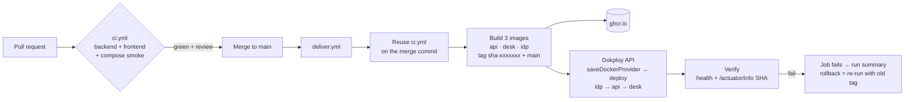

# Seatwise — CI/CD Plan (GitHub Actions → GHCR → Dokploy)

How code gets from a pull request to the live server. GitHub Actions builds
and tests everything, then pushes immutable images to the GitHub Container
Registry. Dokploy only pulls and runs them. **Dokploy never builds from
source.** What CI tested is exactly what runs.

---

## 1. Flow



**Branching:** trunk-based. `main` is always deployable and protected. Work
happens on short-lived `feat/*` and `fix/*` branches merged by PR. There is
no `develop` and no staging environment. A single production environment is
proportionate for a 15-user internal tool, and the PR checks carry the
quality gate.

---

## 2. Repository settings (one-time)

| Setting | Value |
|---|---|
| Branch protection on `main` | Require PR; require status checks `ci / backend`, `ci / frontend`, `ci / compose-smoke`; require branch up to date; no force-push; no deletion |
| Actions → Workflow permissions | Read-only by default; jobs request `packages: write` explicitly |
| Environment `production` | Deployment branches: `main` only. Optional: a required reviewer for a manual gate |
| Environment secrets (`production`) | `DOKPLOY_URL` (e.g. `https://dokploy.example.com`), `DOKPLOY_API_KEY` (Dokploy → Settings → Profile → API keys) |
| Environment variables (`production`) | `DOKPLOY_APP_ID_API`, `DOKPLOY_APP_ID_DESK`, `DOKPLOY_APP_ID_IDP`, `PUBLIC_DESK_URL` (`https://desk.example.com`), `PUBLIC_IDP_URL` (`https://auth.example.com`) |
| Dependabot | `github-actions`, `gradle` (`/backend`), `npm` (`/frontend`), weekly |

Application secrets (DB passwords, Keycloak admin, provisioner secret,
bootstrap admin) are **not** stored in GitHub. They live only in Dokploy's
per-application environment. GitHub only holds the credential needed to tell
Dokploy to deploy.

---

## 3. `ci.yml`: the quality gate

Triggers: `pull_request` (any branch → `main`), `push` to `main`, and
`workflow_call` (so `deliver.yml` can reuse it).

```yaml
name: ci
on:
  pull_request:
  push:
    branches: [main]
  workflow_call:

concurrency:
  group: ci-${{ github.ref }}
  cancel-in-progress: ${{ github.event_name == 'pull_request' }}

permissions:
  contents: read

jobs:
  backend:
    runs-on: ubuntu-24.04
    steps:
      - uses: actions/checkout@v4
      - uses: actions/setup-java@v4
        with: { distribution: temurin, java-version: '25' }
      - uses: gradle/actions/setup-gradle@v4
      # build = compile + ModularityTests + AccessMatrixTest + Testcontainers ITs
      # (CapacityConcurrencyIT included). Ubuntu runners ship Docker.
      - run: ./backend/gradlew -p backend build --no-daemon
      - if: always()
        uses: actions/upload-artifact@v4
        with:
          name: backend-test-reports
          path: backend/build/reports/tests/
      - uses: actions/upload-artifact@v4
        with:
          name: api-jar
          path: backend/build/libs/*.jar
          retention-days: 3

  frontend:
    runs-on: ubuntu-24.04
    steps:
      - uses: actions/checkout@v4
      - uses: pnpm/action-setup@v4
      - uses: actions/setup-node@v4
        with: { node-version: '22', cache: pnpm, cache-dependency-path: frontend/pnpm-lock.yaml }
      - run: pnpm -C frontend install --frozen-lockfile
      - run: pnpm -C frontend lint
      - run: pnpm -C frontend test --ci
      - run: pnpm -C frontend build
      - uses: actions/upload-artifact@v4
        with:
          name: desk-dist
          path: frontend/dist/
          retention-days: 3

  compose-smoke:
    needs: [backend, frontend]
    runs-on: ubuntu-24.04
    steps:
      - uses: actions/checkout@v4
      - run: cp .env.example .env
      - run: docker compose up -d --build --wait --wait-timeout 240
      - uses: pnpm/action-setup@v4
      - uses: actions/setup-node@v4
        with: { node-version: '22', cache: pnpm, cache-dependency-path: frontend/pnpm-lock.yaml }
      - run: pnpm -C frontend install --frozen-lockfile
      - run: pnpm -C frontend exec playwright install --with-deps chromium
      - run: pnpm -C frontend e2e
        env: { E2E_BASE_URL: 'http://localhost:4280' }
      - if: failure()
        run: docker compose logs --no-color > compose-logs.txt
      - if: failure()
        uses: actions/upload-artifact@v4
        with: { name: compose-logs, path: compose-logs.txt }
```

Notes:

- `compose-smoke` proves that the four containers start together with the
  same `compose.yaml` reviewers will use, and that login plus booking work in
  a real browser. If it gets slow, run it only on PRs into `main` (it already
  is).
- `cancel-in-progress` applies only to PRs. A push to `main` runs to
  completion.
- Pin action versions by tag now. Move to commit SHAs with Dependabot later
  (logged in `BACKLOG.md`).

---

## 4. `deliver.yml`: build, push, deploy, verify

Triggers: `push` to `main`, plus `workflow_dispatch` with an optional
`image_tag` input (for rollback or redeploy).

```yaml
name: deliver
on:
  push:
    branches: [main]
  workflow_dispatch:
    inputs:
      image_tag:
        description: 'Existing tag to (re)deploy, e.g. sha-1a2b3c4. Empty = build this commit.'
        required: false

concurrency:
  group: deliver-production
  cancel-in-progress: false        # never stop a release halfway

permissions:
  contents: read

env:
  REGISTRY: ghcr.io
  IMAGE_PREFIX: ghcr.io/${{ github.repository_owner }}/seatwise

jobs:
  gate:
    if: ${{ inputs.image_tag == '' }}
    uses: ./.github/workflows/ci.yml

  images:
    needs: gate
    if: ${{ inputs.image_tag == '' }}
    runs-on: ubuntu-24.04
    permissions: { contents: read, packages: write }
    strategy:
      matrix:
        include:
          - { name: api,  context: backend,        file: backend/Dockerfile }
          - { name: desk, context: frontend,       file: frontend/Dockerfile }
          - { name: idp,  context: infra/keycloak, file: infra/keycloak/Dockerfile }
    steps:
      - uses: actions/checkout@v4
      - uses: docker/setup-buildx-action@v3
      - uses: docker/login-action@v3
        with: { registry: ghcr.io, username: '${{ github.actor }}', password: '${{ secrets.GITHUB_TOKEN }}' }
      - id: meta
        uses: docker/metadata-action@v5
        with:
          images: ${{ env.IMAGE_PREFIX }}-${{ matrix.name }}
          tags: |
            type=sha,prefix=sha-,format=short
            type=raw,value=main
          labels: org.opencontainers.image.revision=${{ github.sha }}
      - uses: docker/build-push-action@v6
        with:
          context: ${{ matrix.context }}
          file: ${{ matrix.file }}
          push: true
          platforms: linux/amd64          # match the Dokploy server's arch
          build-args: GIT_SHA=${{ github.sha }}
          tags: ${{ steps.meta.outputs.tags }}
          labels: ${{ steps.meta.outputs.labels }}
          cache-from: type=gha,scope=${{ matrix.name }}
          cache-to: type=gha,mode=max,scope=${{ matrix.name }}

  deploy:
    needs: images
    if: ${{ always() && (needs.images.result == 'success' || inputs.image_tag != '') }}
    runs-on: ubuntu-24.04
    environment:
      name: production
      url: ${{ vars.PUBLIC_DESK_URL }}
    steps:
      - name: Resolve tag
        id: tag
        run: |
          if [ -n "${{ inputs.image_tag }}" ]; then echo "tag=${{ inputs.image_tag }}" >> "$GITHUB_OUTPUT"
          else echo "tag=sha-${GITHUB_SHA::7}" >> "$GITHUB_OUTPUT"; fi
      - name: Deploy idp → api → desk
        env:
          DOKPLOY_URL: ${{ secrets.DOKPLOY_URL }}
          DOKPLOY_API_KEY: ${{ secrets.DOKPLOY_API_KEY }}
          TAG: ${{ steps.tag.outputs.tag }}
        run: |
          set -euo pipefail
          deploy() {  # $1 = app id, $2 = image
            # Point the app at the exact immutable tag. Credentials are null:
            # Dokploy pulls with the registry login saved once on the server (§5.2).
            curl -fsS -X POST "$DOKPLOY_URL/api/application.saveDockerProvider" \
              -H "x-api-key: $DOKPLOY_API_KEY" -H 'Content-Type: application/json' \
              -d "{\"applicationId\":\"$1\",\"dockerImage\":\"$2\",\"username\":null,\"password\":null,\"registryUrl\":null}"
            curl -fsS -X POST "$DOKPLOY_URL/api/application.deploy" \
              -H "x-api-key: $DOKPLOY_API_KEY" -H 'Content-Type: application/json' \
              -d "{\"applicationId\":\"$1\"}"
          }
          deploy "${{ vars.DOKPLOY_APP_ID_IDP }}"  "$IMAGE_PREFIX-idp:$TAG"
          deploy "${{ vars.DOKPLOY_APP_ID_API }}"  "$IMAGE_PREFIX-api:$TAG"
          deploy "${{ vars.DOKPLOY_APP_ID_DESK }}" "$IMAGE_PREFIX-desk:$TAG"
          echo "Deployed $TAG" >> "$GITHUB_STEP_SUMMARY"

  verify:
    needs: deploy
    runs-on: ubuntu-24.04
    steps:
      - name: Wait for health and prove the running SHA
        env:
          DESK: ${{ vars.PUBLIC_DESK_URL }}
          EXPECTED: ${{ inputs.image_tag != '' && '' || github.sha }}
        run: |
          set -euo pipefail
          for i in $(seq 1 40); do
            if curl -fsS "$DESK/api/actuator/health/readiness" | grep -q '"UP"'; then break; fi
            sleep 6
          done
          curl -fsS "$DESK/api/actuator/health/readiness" | grep -q '"UP"'
          curl -fsS "$DESK/" | grep -qi '<app-root'
          curl -fsS "${{ vars.PUBLIC_IDP_URL }}/realms/seatwise/.well-known/openid-configuration" > /dev/null
          if [ -n "$EXPECTED" ]; then
            RUNNING=$(curl -fsS "$DESK/api/actuator/info" | jq -r '.git.commit.id.full // .build.revision')
            echo "running=$RUNNING expected=$EXPECTED"
            [ "$RUNNING" = "$EXPECTED" ]
          fi
```

Why each choice:

- **Reusing `ci.yml` as the gate** means the merge commit itself is tested
  before anything ships, not just the PR head.
- **Immutable `sha-` tags.** Dokploy is pointed at an exact tag, so a deploy
  is reproducible and rollback is a re-point. `main` is a convenience tag
  only, never deployed by name.
- **Deploy order idp → api → desk.** The API needs the realm to be up for
  JWKS and the provisioner. The desk is last so the UI never runs ahead of
  the API.
- **Verify by SHA, not by "deploy succeeded".** A successful
  `application.deploy` call only means Dokploy accepted the job. The verify
  job proves the new build is the one actually serving traffic.
- **`/actuator/*` through the desk proxy:** expose only `health` and `info`
  publicly. The desk nginx proxies `/api/actuator/(health|info)` and nothing
  else under actuator.

---

## 5. Dokploy setup (one-time)

### 5.1 Project layout

Dokploy project **`seatwise`**, environment **production**:

| Service | Dokploy type | Source | Domain | Port | Notes |
|---|---|---|---|---|---|
| `seatwise-db` | PostgreSQL 17 | Dokploy DB | none (internal) | 5432 | DB `seatwise`. Scheduled backups to S3 destination, daily, keep 14 |
| `seatwise-idp-db` | PostgreSQL 17 | Dokploy DB | none (internal) | 5432 | DB `keycloak`. Separate so IdP and app data are backed up and restored independently |
| `seatwise-idp` | Application | Docker image `ghcr.io/<owner>/seatwise-idp:<tag>` | `auth.example.com` (HTTPS, Let's Encrypt) | 8080 | |
| `seatwise-api` | Application | Docker image `ghcr.io/<owner>/seatwise-api:<tag>` | none (internal) | 8080 | |
| `seatwise-desk` | Application | Docker image `ghcr.io/<owner>/seatwise-desk:<tag>` | `desk.example.com` (HTTPS, Let's Encrypt) | 80 | |

Copy each application's id from its Dokploy URL into the GitHub environment
variables (§2).

### 5.2 Registry access

- Dokploy → Settings → Registry → add `ghcr.io` with a GitHub token that has
  **only `read:packages`**, owned by a bot or org account, and **without an
  expiry that will silently lapse**. Calendar its renewal if the org policy
  forces an expiry.
- Never use the workflow's `GITHUB_TOKEN` for this. It expires when the job
  ends, before Dokploy pulls.
- Simpler alternative for the challenge: make the three GHCR packages
  **public**. The images contain no secrets, so Dokploy can then pull with no
  credentials at all.

### 5.3 Environment per application (Dokploy → Environment)

**seatwise-idp**

```
KC_DB=postgres
KC_DB_URL=jdbc:postgresql://seatwise-idp-db:5432/keycloak
KC_DB_USERNAME=…            KC_DB_PASSWORD=…
KC_HOSTNAME=https://auth.example.com
KC_PROXY_HEADERS=xforwarded
KC_HTTP_ENABLED=true        # TLS terminates at Traefik
KC_HEALTH_ENABLED=true
KC_BOOTSTRAP_ADMIN_USERNAME=…   KC_BOOTSTRAP_ADMIN_PASSWORD=…   # master-realm admin, ops only
SEATWISE_DESK_URL=https://desk.example.com          # used by realm-file placeholders
SEATWISE_PROVISIONER_SECRET=…                        # same value as in seatwise-api
```

Command: `start --optimized --import-realm`. The image is built with
`kc.sh build --db=postgres --health-enabled=true`, and the realm file is
copied to `/opt/keycloak/data/import/`. The realm file uses `${…}`
placeholders for redirect URIs and the client secret, so one file serves
local and production.

**seatwise-api**

```
SPRING_PROFILES_ACTIVE=prod,demo     # drop "demo" once real data exists
SPRING_DATASOURCE_URL=jdbc:postgresql://seatwise-db:5432/seatwise
SPRING_DATASOURCE_USERNAME=…  SPRING_DATASOURCE_PASSWORD=…
SEATWISE_OIDC_ISSUER=https://auth.example.com/realms/seatwise
SEATWISE_OIDC_JWKS=http://seatwise-idp:8080/realms/seatwise/protocol/openid-connect/certs
SEATWISE_KEYCLOAK_ADMIN_BASE=http://seatwise-idp:8080
SEATWISE_PROVISIONER_SECRET=…
SEATWISE_BOOTSTRAP_ADMIN_EMAIL=…  SEATWISE_BOOTSTRAP_ADMIN_PASSWORD=…
SEATWISE_BOOTSTRAP_PASSWORD_TEMPORARY=true
SEATWISE_CENTRE_TIMEZONE=…            # e.g. Europe/London; confirm with the client
JAVA_TOOL_OPTIONS=-XX:MaxRAMPercentage=75
```

**seatwise-desk**

```
API_UPSTREAM=http://seatwise-api:8080
SEATWISE_IDP_URL=https://auth.example.com
SEATWISE_REALM=seatwise
SEATWISE_CLIENT_ID=seatwise-desk
```

Internal hostnames assume that Dokploy's internal network resolves
application names. Use the service names Dokploy shows under each app's
"Advanced → Network" and adjust if they differ.

### 5.4 Health checks and zero-downtime

- **api:** Dokploy → Advanced → Swarm settings → health check
  `CMD curl -fsS http://localhost:8080/actuator/health/readiness`, interval
  10 s, retries 6, start period 60 s. Update config
  `order: start-first, failure_action: rollback`. The new container must be
  healthy before the old one stops, and a failed health check rolls back
  automatically.
- **desk:** `CMD wget -qO- http://localhost/healthz` (a static nginx
  location), same update config.
- **idp:** `http://localhost:9000/health/ready` (Keycloak management port).
  Use `stop-first`, because Keycloak cluster caches don't need two instances
  side by side here.
- Flyway runs on API startup. With `start-first`, migrations must be
  **backward compatible** with the previous release for the overlap window.
  Follow expand → migrate → contract.

---

## 6. Rollback and recovery

| Situation | Action |
|---|---|
| Verify job fails right after deploy | Swarm `failure_action: rollback` usually already reverted. Otherwise run **deliver → Run workflow** with `image_tag` = the last good `sha-…` (from the previous run summary). |
| Bad release discovered later | Same: redeploy the previous tag. Only safe if the release added no contract-phase migration. Otherwise ship a forward fix. |
| Data loss / corruption | Restore `seatwise-db` from the Dokploy S3 backup. Keycloak data (`seatwise-idp-db`) is restored separately. |
| Dokploy API key leaked | Revoke it in Dokploy, create a new one, update the GitHub environment secret. |

Forward-only Flyway: never edit an applied migration. Rollback is a new
`V<n+1>` migration, never `flyway undo`.

---

## 7. Observability (minimum)

- Container logs in Dokploy. The API logs JSON in `prod`, with `requestId`
  and `actorId` in MDC.
- `GET /actuator/info` reports the git SHA and build time (Gradle
  `gradle-git-properties` + `springBoot { buildInfo() }`).
- A Dokploy notification (email, Slack or Discord) on deploy failure.
- An optional uptime check (UptimeRobot or similar) on
  `https://desk.example.com/healthz`.

---

## 8. Rollout checklist

1. [ ] Create the GitHub repo, push `main`, enable branch protection (§2)
2. [ ] `ci.yml` green on a first PR
3. [ ] Dokploy: create the project, two Postgres services and three apps (§5.1). Set env (§5.3), domains + HTTPS, and health checks (§5.4)
4. [ ] Registry access (§5.2): public packages, or a `read:packages` token
5. [ ] GitHub `production` environment: secrets + vars (§2)
6. [ ] Merge to `main` → `deliver.yml` → verify job green
7. [ ] Log in at `https://desk.example.com` as the bootstrap Admin, change the password, create Manager/Staff
8. [ ] Run the SRS §8 acceptance script on the live URL
9. [ ] Test rollback once: run deliver with the previous `sha-` tag, confirm `/actuator/info` changes back, then redeploy latest
10. [ ] Put the live URL in the README
